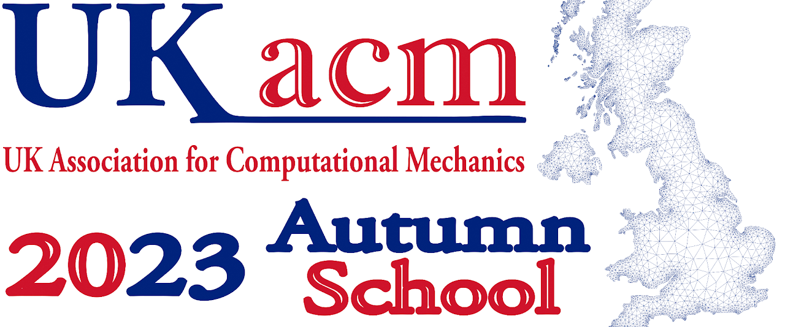

# Docker installation

## Docker installation

You can install Docker following instructions here [link](https://docs.docker.com/engine/install/).

## How to run the container

1. Pull image
~~~~
docker pull likask/mofem-spack-jupyterhub:Workshop2023
~~~~
2. Run container
- If you like, just try the container that after the shutdown of the JupyterHub container will be removed, run docker it as follows, 
~~~~
docker run --rm --name workshop2023 -p 8000:8000 -p 2222:22 likask/mofem-spack-jupyterhub:Workshop2023
~~~~
- If you would like to switch it on for some time, we recommend running it as a demon,
~~~~~
docker run -d --name workshop2023 -p 8000:8000 -p 2222:22 likask/mofem-spack-jupyterhub:Workshop2023
~~~~~
- In case you run it on the laptop/server and shut down it, after reboot, you can restart the container as follows.
~~~~~
docker start workshop2023
~~~~~

#### M1 chip case on Mac

If you have run a Mac with an ARM chip, you have to switch platforms when you run the compiler,
~~~~~~
docker run -d --platform linux/amd64 --name workshop2023 -p 8000:8000 -p 2222:22 likask/mofem-spack-jupyterhub:Workshop2023
~~~~~~
That results in suboptimal performance; however, it is a workable solution but could be faster. 

> The base system is Ubuntu 20.04. To compile code for *arm* architecture, we would have to upgrade the system to Ubuntu 22.04, and then it would be possible to compile MoFEM ecosystem for M1 chip. That is tested and works. However, additionally, you would have to compile gMesh from scratch. Python pip installation for gMesh and *arm* architectures is not available. If you know how to do it, we will welcome PR from you to fix this problem.

## How to connect to the container

- If you run a container locally, [http://localhost:8000](http://localhost:8000)
- If you install the Docker package into SSH you can attach directly to the running container as a *root* user.
- You can log in using VSCode after installing the package RenonteSSH using SSH.
- Also, you can SSH as follows
~~~~~
ssh -p 2222 mofem@localhost
~~~~~

> You must set a *mofem* user password before logging in using SSH. To do that, you can attach it to the container and set a password, as follows;
~~~~
docker exec -it workshop2023 /bin/bash
~~~~
> one you are in,
~~~~
passwd mofem 
~~~~ 

## Password and login

- On the first login, select the password. The login name is *mofem*. You have admin rights, and you can add more users.
- The shell password on the SSH login is different than the JupyterHub password. Shell password is *123*.
- Change password in the shell using [passwd](https://man7.org/linux/man-pages/man1/passwd.1.html){:target="_blank" rel="noopener"} command
- Set up your shell with the command (e.g. bash):
~~~~
$ usermod --shell /bin/bash your_login_name
~~~~
You can use other shells, depending on your personal preferences.

## Login and starting work

- Login as user "mofem"; you set a password on the first login. Note this is the password to JupyterHub, not a password to the Linux environment.
- Before you start, execute *install.md* notebook. It will create a local view of the generic MoFEM installation used by default in example notebooks.

## Being a good citizen

This is a case when the container is running on a server and you share resources with other users.

- If you run something with multiprocess which will run longer than 5-10 minutes, be nice, i.e. run the command as follows
~~~~
nice -n 10 mpirun -np 2 ./command_line
~~~~

## SSH config

Copy the following code into .ssh/config on your laptop or desktop.
~~~~
Host workshop2023
  HostName localhost
  ForwardX11 yes
  Compression yes
  User mofem
  Port 2222
~~~~

Use *workshop2023* when you log in through VSCode. Note that you are connecting to *jupyterhub cloud/docker container*.

{:target="_blank" rel="noopener"}

## Video on JuputerHub, SSH and MoFEM

# Workshop 2023

[Glasgow Computational Engineering Centre](https://www.gla.ac.uk/research/az/gcec/) of the University of Glasgow  is proud to organise the first Autumn School of the [UK Association for Computational Mechanics](https://ukacm.org).

The objective of this online course is to present new advances in mixed finite element formulations in solid mechanics and novel techniques for modelling deformable solids at finite strains. The lectures are focused on both the mechanical and mathematical aspects.  The specific topics of this course include saddle point formulations to handle incompressibility constraints, block-solvers, thermo-elasticity, novel multifield formulations for plasticity and incompressible hyperelasticity, and the recent development of the first-order hyperbolic framework for fast-transient solid dynamics. Moreover, we will also provide hands-on training with MoFEM on the cloud platform on these topics.

## Programme

Link to programme [link](https://drive.google.com/file/d/17aD4O-mxYrhhLBaUtaC6G61ZZh1P1Dwy/view)

